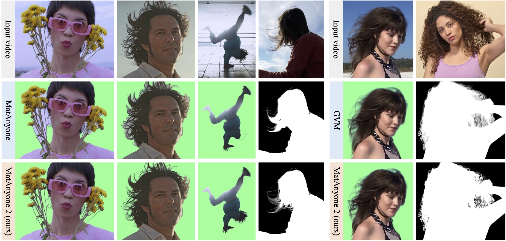

# ReliMat: Reliability-Aware Refinement for High-Quality Video Matting

<div align="center">

<h2>ReliMat: Reliability-Aware Refinement for High-Quality Video Matting</h2>

<p>
  <strong>Reliability-aware refinement for accurate, temporally consistent, and visually refined video alpha mattes.</strong>
</p>

<!-- Replace the links below with the official project/code links when available. -->
<a href="YOUR_PROJECT_PAGE_URL" target="_blank">
  
</a>
<a href="YOUR_ARXIV_URL" target="_blank">
  
</a>
<a href="YOUR_VIDEO_URL" target="_blank">
  
</a>

</div>

---

## 📌 Overview

Video matting aims to estimate a continuous-valued alpha matte that describes the opacity of foreground objects at every pixel. Unlike semantic segmentation, matting requires recovering fine structures, semi-transparent regions, hair, motion boundaries, and subtle foreground details while maintaining temporal consistency across frames.

We propose **ReliMat**, a reliability-aware refinement framework for high-quality video matting. ReliMat introduces a **Matte Reliability Predictor (MRP)** that estimates pixel-wise reliability directly from the predicted matte and visual information, without requiring ground-truth alpha references during reliability estimation. The resulting reliability maps identify trustworthy and uncertain regions and are used to adaptively guide matte refinement.

In addition, ReliMat employs a **reference-frame learning strategy** to exploit long-range temporal information. By combining reliability-aware refinement with reference-frame modeling, the framework improves boundary reconstruction, preserves fine foreground structures, and increases robustness to appearance changes and complex motion.

Experiments on **VideoMatte, YoutubeMatte, and CRGNN** demonstrate that ReliMat produces accurate, temporally consistent, and visually refined alpha mattes.

<div align="center">
  
</div>

---

## ✨ Highlights

- **Matte Reliability Predictor (MRP):** predicts pixel-wise reliability without requiring ground-truth alpha references.
- **Reliability-aware refinement:** focuses refinement on uncertain regions while preserving already reliable matte regions.
- **Reference-frame learning:** captures long-range temporal dependencies beyond neighboring frames.
- **Fine-detail preservation:** improves hair, thin structures, semi-transparent regions, and complex boundaries.
- **Temporal robustness:** improves matte consistency under motion and appearance variations.
- **Real-world evaluation:** evaluated on VideoMatte, YoutubeMatte, and CRGNN benchmarks.

---

## 🔎 Framework Overview

The overall ReliMat pipeline consists of three major components:

1. **Initial Video Matting:** produces an initial alpha matte from the input video.
2. **Matte Reliability Predictor (MRP):** estimates pixel-wise reliability and identifies uncertain matte regions.
3. **Reliability-Aware Refinement with Reference Frames:** uses reliability-guided supervision and reference-frame information to refine uncertain regions while preserving reliable predictions.

<div align="center">
  
</div>

> **Note:** If your repository uses a different filename for the framework figure, replace `assets/framework.jpg` accordingly.

---

## 🧩 Method

### Matte Reliability Predictor

The Matte Reliability Predictor estimates the confidence/reliability of the predicted alpha matte at the pixel level. Instead of treating all pixels equally, ReliMat distinguishes between regions that are already reliable and regions where the matte prediction is uncertain.

The reliability map is subsequently used to construct reliability-aware supervision for the refinement network.

### Reliability-Aware Refinement

The refinement stage adaptively focuses on uncertain matte regions. This allows the network to correct inaccurate boundaries and recover missing details without unnecessarily modifying already accurate foreground regions.

### Reference-Frame Learning

Video matting requires temporal information because appearance and motion can change substantially over time. ReliMat introduces a reference-frame learning strategy to provide long-range temporal cues, helping the model maintain consistent matte structures under complex motion and appearance variations.

---

## 📮 Updates

- **[YYYY.MM]** Initial release of ReliMat.
- **[YYYY.MM]** Released inference code and pretrained models.
- **[YYYY.MM]** Released evaluation code.
- **[YYYY.MM]** Released training code, if applicable.

---

## 🛠️ Installation

### 1. Clone the Repository

```bash
git clone YOUR_REPOSITORY_URL
cd relimat
```

### 2. Create the Conda Environment

We recommend using Python 3.10.

```bash
conda create -n relimat python=3.10 -y
conda activate relimat
```

### 3. Install PyTorch

Install the PyTorch version compatible with your CUDA environment.

For example:

```bash
pip install torch torchvision
```

> For reproducible experiments, please use the PyTorch and CUDA versions specified in the release notes or environment file provided with the repository.

### 4. Install Dependencies

```bash
pip install -r requirements.txt
```

If the repository provides a local package configuration, install it with:

```bash
pip install -e .
```

---

## 📦 Pretrained Models

Download the released ReliMat checkpoints and place them under:

```text
pretrained_models/
├── relimat.pth
└── ...
```

If multiple checkpoints are provided, use the checkpoint corresponding to the dataset/model configuration you want to evaluate.

Example:

```text
pretrained_models
└── relimat.pth
```

> Replace the checkpoint URL and filename with the official release path once the pretrained models are publicly available.

---

# 🔥 Inference

## Input Format

ReliMat takes a video together with an initial foreground/target mask.

The input directory can be organized as:

```text
inputs/
├── videos/
│   ├── sample1.mp4
│   └── sample2.mp4
│
└── masks/
    ├── sample1.png
    └── sample2.png
```

The mask should indicate the target foreground object(s) in the reference/first frame according to the input protocol used by the released model.

---

## Quick Test

After downloading the pretrained model, run:

```bash
python inference.py \
    --input inputs/videos/sample1.mp4 \
    --mask inputs/masks/sample1.png \
    --checkpoint pretrained_models/relimat.pth
```

If your implementation uses a different inference entry point, replace `inference.py` and the corresponding arguments with the provided script.

For example, a folder containing video frames can be processed as:

```bash
python inference.py \
    --input inputs/videos/sample1 \
    --mask inputs/masks/sample1.png \
    --checkpoint pretrained_models/relimat.pth
```

---

## Output

The generated results are saved to the specified output directory.

A typical output structure is:

```text
results/
└── sample1/
    ├── alpha/
    │   ├── 000000.png
    │   ├── 000001.png
    │   └── ...
    │
    ├── alpha.mp4
    └── foreground.mp4
```

The alpha output contains the predicted continuous-valued matte, where:

- `0` represents background,
- `1` represents foreground,
- intermediate values represent partially transparent regions.

---

## ⚡ Command-Line Interface

If a CLI entry point is provided, inference can also be launched using:

```bash
relimat --input inputs/videos/sample1.mp4 \
        --mask inputs/masks/sample1.png \
        --checkpoint pretrained_models/relimat.pth
```

Run:

```bash
relimat --help
```

to view all available options.

---

## 🐍 Python API

If the repository exposes a Python API, inference can be performed programmatically:

```python
from relimat import ReliMat

model = ReliMat.from_pretrained(
    "PATH_TO_CHECKPOINT"
)

model.process_video(
    input_path="inputs/videos/sample1.mp4",
    mask_path="inputs/masks/sample1.png",
    output_path="results/sample1"
)
```

> Update the import and API names to match the released implementation.

---

# 🎪 Interactive Demo

If an interactive Gradio demo is included, launch it with:

```bash
cd demo
pip install -r requirements.txt
python app.py
```

The interface can be used to:

1. Upload a video.
2. Select the target foreground.
3. Provide the initial mask when required.
4. Run ReliMat.
5. Visualize the generated alpha matte and foreground result.

Example:

<div align="center">
  
</div>

> Replace `assets/demo.gif` with the actual demo asset if available.

---

# 📊 Evaluation

ReliMat is evaluated on three real-world video matting benchmarks:

- **VideoMatte**
- **YoutubeMatte**
- **CRGNN**

The primary evaluation metrics include:

- **MAD** ↓ — Mean Absolute Difference
- **MSE** ↓ — Mean Squared Error
- **Grad** ↓ — Gradient error
- **Conn** ↓ — Connectivity error

Please refer to the evaluation scripts/configurations included in the repository for the exact benchmark protocol.

### Evaluate VideoMatte

```bash
python evaluate.py \
    --dataset videomatte \
    --data_root YOUR_VIDEOMATTE_ROOT \
    --checkpoint pretrained_models/relimat.pth
```

### Evaluate YoutubeMatte

```bash
python evaluate.py \
    --dataset youtubematte \
    --data_root YOUR_YOUTUBEMATTE_ROOT \
    --checkpoint pretrained_models/relimat.pth
```

### Evaluate CRGNN

```bash
python evaluate.py \
    --dataset crgnn \
    --data_root YOUR_CRGNN_ROOT \
    --checkpoint pretrained_models/relimat.pth
```

> Replace the command-line arguments with the exact evaluation interface implemented in the released repository.

---

# 📚 Dataset Preparation

## VideoMatte

Prepare the VideoMatte dataset according to its official organization and place it under:

```text
data/
└── VideoMatte/
    ├── train/
    ├── test/
    └── ...
```

## YoutubeMatte

Place the YoutubeMatte videos and corresponding alpha annotations under:

```text
data/
└── YoutubeMatte/
    ├── videos/
    ├── alpha/
    └── ...
```

## CRGNN

Place the CRGNN dataset under:

```text
data/
└── CRGNN/
    ├── videos/
    ├── alpha/
    └── ...
```

The exact directory layout should follow the dataset preparation scripts included with this repository.

---

# 🏋️ Training

If training code is released, the complete training pipeline consists of:

### Stage 1: Initial Matting Model

Train the base video matting network to obtain initial alpha matte predictions.

```bash
python train_matting.py \
    --data_root YOUR_DATA_ROOT \
    --save_dir checkpoints/matting
```

### Stage 2: Matte Reliability Predictor

Train the Matte Reliability Predictor using the training data and generated matte predictions.

```bash
python train_mrp.py \
    --data_root YOUR_DATA_ROOT \
    --matting_checkpoint checkpoints/matting/model.pth \
    --save_dir checkpoints/mrp
```

### Stage 3: Reliability-Aware Refinement

Train the final refinement network using the predicted reliability maps and reference-frame information.

```bash
python train_relimat.py \
    --data_root YOUR_DATA_ROOT \
    --matting_checkpoint checkpoints/matting/model.pth \
    --mrp_checkpoint checkpoints/mrp/model.pth \
    --save_dir checkpoints/relimat
```

> If training code is not publicly released, remove this section or replace it with the current release status.

---

# 🗂️ Repository Structure

A recommended repository structure is:

```text
ReliMat/
├── assets/
│   ├── teaser.jpg
│   ├── framework.jpg
│   └── demo.gif
│
├── configs/
│   └── ...
│
├── data/
│   └── ...
│
├── datasets/
│   └── ...
│
├── models/
│   ├── matting/
│   ├── mrp/
│   ├── refinement/
│   └── reference/
│
├── checkpoints/
│   └── ...
│
├── inputs/
│   ├── videos/
│   └── masks/
│
├── results/
│   └── ...
│
├── inference.py
├── evaluate.py
├── train_matting.py
├── train_mrp.py
├── train_relimat.py
├── requirements.txt
├── README.md
└── LICENSE
```

---

# 🧪 Ablation Studies

ReliMat evaluates the contribution of its major components through controlled ablation experiments.

The main components include:

| Configuration | Reliability Prediction | Reliability-Aware Refinement | Reference-Frame Learning |
|---|:---:|:---:|:---:|
| Baseline | ✗ | ✗ | ✗ |
| + MRP | ✓ | ✗ | ✗ |
| + Reliability Refinement | ✓ | ✓ | ✗ |
| **ReliMat** | ✓ | ✓ | ✓ |

These experiments demonstrate the individual and combined benefits of reliability estimation, adaptive refinement, and long-range temporal modeling.

---

# 🎥 Qualitative Results

ReliMat is designed to improve difficult regions such as:

- Fine hair structures
- Thin foreground objects
- Motion boundaries
- Semi-transparent regions
- Complex object contours
- Fast and irregular motion
- Appearance changes across frames

<div align="center">
  
</div>

For additional visual comparisons, please refer to the project page.

---

# 📈 Results

ReliMat is evaluated against representative video matting methods on VideoMatte, YoutubeMatte, and CRGNN.

The complete quantitative comparison is provided in the paper.

Example table format:

| Method | VideoMatte MAD ↓ | VideoMatte MSE ↓ | YoutubeMatte MAD ↓ | YoutubeMatte MSE ↓ | CRGNN MAD ↓ | CRGNN MSE ↓ |
|---|---:|---:|---:|---:|---:|---:|
| Baseline | - | - | - | - | - | - |
| Method A | - | - | - | - | - | - |
| Method B | - | - | - | - | - | - |
| **ReliMat** | **-** | **-** | **-** | **-** | **-** | **-** |

> Insert the final paper values before publishing the repository README.

---

# 📝 Citation

If you find ReliMat useful for your research, please consider citing:

```bibtex
@article{relimat2026,
  title   = {ReliMat: Reliability-Aware Refinement for High-Quality Video Matting},
  author  = {YOUR AUTHORS},
  journal = {YOUR VENUE},
  year    = {2026}
}
```

---

# 📜 License

This project is released under the license specified in `LICENSE`.

Please check the license file before using the code, pretrained models, or other released assets for commercial or redistribution purposes.

---

# 🙏 Acknowledgements

We thank the authors of the publicly available video matting datasets, baseline methods, and supporting libraries used in this project.

We also acknowledge the broader research community for their contributions to video matting, image matting, segmentation, temporal modeling, and alpha-matte refinement.

If specific repositories are directly used by ReliMat, please list them here with their corresponding licenses.

---

# 📧 Contact

For questions, issues, or collaboration inquiries, please open a GitHub issue or contact the authors through the email addresses listed in the paper.

---

## ⭐ Star the Repository

If ReliMat is useful for your research, please consider starring the repository and citing our work.
